<h1 align="center">JavBoss</h1>

<p align="center">本地 JAV/视频 管理一站式解决方案：自动扫描目录视频生成封面截图，识别 JAV 并抓取元数据，提供强大的视频和 JAV 检索功能，并通过内置 mpv 播放器快速播放。</p>

<p align="center">
  <a href="https://github.com/Solr159/JavBoss/releases"></a>
  <a href="https://github.com/Solr159/JavBoss/stargazers"></a>
  <a href="https://github.com/Solr159/JavBoss/releases"></a>
  <a href="https://go.dev/"></a>
</p>

**此项目仍处于快速迭代中，点个 Star ⭐支持一下，不错过任何新版本功能更新，你的支持是作者积极更新的动力😊。**


## 为什么选择 JavBoss？

- 零配置开箱即用，小白也能轻松上手。

- 横跨 Windows、MacOS、Linux 三大平台，也支持通过 Docker 部署在 NAS 中长期运行。

- 视频扫描、刮削、管理、播放等全链路完全自研，不被第三方软件卡脖子。

- 针对 JAV 场景进行深度定制，体验远超 `JAV刮削器`+`通用媒体库` 的常规组合。

- 可在`视频`和`JAV`两种运行模式之间自由切换，既是一个专业的 JAV 管理软件，也可作为通用视频管理软件使用。

- 深度集成 MPV 播放器，支持播放进度条预览，视频截图书签等高级功能。

- 零侵入式设计，运行数据单独存放，充分尊重用户视频目录，不做任何修改。

- 简单直观的 UI 设计，基本不需要任何使用文档，打开就知道怎么用。

> **作者比较懒，不喜欢写文档，实际上此软件还有批量删除视频、手动刮削、目录整理、导出 nfo 和封面等高级功能，请用户使用过程中自行挖掘。**

## 快速开始

### 1. 选择安装方式

#### 方式一：命令行一键安装（推荐）

<dl>
<dd>

Windows PowerShell：

```powershell
irm https://raw.githubusercontent.com/Solr159/JavBoss/main/scripts/install.ps1 | iex
```

Linux / macOS：

```bash
curl -fsSL https://raw.githubusercontent.com/Solr159/JavBoss/main/scripts/install.sh | bash
```

安装脚本会自动下载对应系统的最新版发布包，完成安装后启动 JavBoss。

以后每次打开：

- Windows：双击桌面的 `JavBoss` 快捷方式，或在开始菜单中搜索 `JavBoss`。
- Linux / macOS：打开终端运行 `javboss`。

</dd>
</dl>

#### 方式二：手动下载

<dl>
<dd>

点击下载对应系统的最新版发布包并解压：

- [Windows](https://github.com/Solr159/JavBoss/releases/download/v2.0.1/javboss-v2.0.1-windows-x86_64.zip)
- [Linux](https://github.com/Solr159/JavBoss/releases/download/v2.0.1/javboss-v2.0.1-linux-x86_64.zip)
- [macOS-x86_64](https://github.com/Solr159/JavBoss/releases/download/v2.0.1/javboss-v2.0.1-macos-x86_64.zip)（适用于 Intel 芯片的 macOS）
- [macOS-arm64](https://github.com/Solr159/JavBoss/releases/download/v2.0.1/javboss-v2.0.1-macos-arm64.zip)（适用于 M 芯片的 macOS）

也可以前往 [Releases](https://github.com/Solr159/JavBoss/releases) 页面查看所有版本。

下载解压后启动程序：

- Windows：双击 `javboss.exe`。首次运行可能会被 SmartScreen 阻止，点击“更多信息” -> “仍要运行”。
- macOS：打开终端运行 `javboss.command`。
- Linux：打开终端运行 `javboss`。

</dd>
</dl>

#### 方式三：Docker 部署

<dl>
<dd>

docker-compose.yaml：

```yaml
services:
  javboss:
    image: ghcr.io/solr159/javboss:latest
    container_name: javboss
    ports:
      - "8655:17654"
    extra_hosts:
      - "host.docker.internal:host-gateway"
    volumes:
      - ./data:/app/data
      - /:/host:ro
    restart: unless-stopped
```

启动：

```bash
docker compose up -d
```

Docker 部署下使用浏览器播放视频，不会调用本机 mpv。添加目录时直接填写宿主机路径，例如 `/mnt/disk1/videos`，程序会自动映射到容器内可访问路径。

</dd>
</dl>

</br>

**浏览器访问地址：`http://localhost:8655`，非 docker 方式启动后，程序会自动打开浏览器。</br>**
**Docker 方式启动默认支持局域网设备访问，将 `localhost` 改为部署主机的局域网ip。非 docker 方式需要在全局设置中手动开启局域网访问，然后重启软件。</br>**
**默认登录密码为 `admin`，可在全局设置中修改。**

### 2. 添加本地目录

点击左下角“设置” -> “目录管理”，添加存放视频的本地文件夹。

视频扫描入库、封面截图生成、JAV 刮削会在后台持续运行，刷新页面或点击侧边栏视频、作品等按钮查看当前进度。

**注意事项：**
  - 能够正常访问外网是获取 JAV 数据的前提。
  - JavBoss 只会读取不会主动修改目录里的任何内容，请放心添加。
  - 你可以随时关闭应用程序，下次打开所有任务会自动重启。
  - JAV 模式下的女优详情、厂商、系列等信息会逐渐补齐，请耐心等待（补齐速度：女优≈厂商>系列）。

## 目录扫描和 JAV 刮削说明

程序默认会自动持续对目录进行扫描，扫描过程中同步进行 JAV 刮削，相邻两次扫描间隔为1分钟。

可以在`全局设置`->`目录管理`->`扫描设置`中修改相邻扫描间隔或关闭自动扫描。也可点击`手动扫描`立刻触发一次目录扫描和 JAV 刮削。

一旦目录内容发生任何变化（比如有新视频入库、旧视频被删除、视频移动等），需要再进行一次目录扫描和 JAV 刮削完成内容的更新同步，请根据个人的扫描设置自行把握扫描时机。

对于通过 docker 部署在 NAS 中长期运行的用户，建议调大扫描间隔或者关闭自动扫描，避免影响硬盘寿命。

**请注意一次扫描并不能保证所有可刮削的视频都被成功刮削，原因是每次扫描过程中每个视频只会尝试一次刮削，可能会因为网络抖动或者网站风控等原因导致部分请求失败，个人实测每次扫描约1%左右的视频会刮削失败，需要再扫描一次。**

## 如何升级版本

#### 一键安装用户

先退出正在运行的 JavBoss，然后重新执行一键安装命令即可升级。

#### 手动下载用户

下载并解压新版本后，将旧版本目录中的 `data/` 文件夹复制到新版本目录，然后启动新版本。

（注意要先复制再启动。如果直接启动，程序会自动生成 `data/` 目录，你需要先退出程序，手动删除掉 `data/` 目录再复制）。

#### Docker 用户

进入 `docker-compose.yaml` 所在目录，拉取新镜像并重启：

```bash
docker compose pull
docker compose up -d
```

升级时请保留 `./data` 目录，它保存了数据库、封面、截图等运行数据。

## 手动下载老用户迁移一键安装

先执行一键安装命令，然后将手动下载目录中的 `data/` 文件夹复制到一键安装目录中（复制前请先手动删除一键安装目录中的 `data/` 文件夹）。

一键安装默认目录：

- Windows：`C:\Users\你的用户名\AppData\Local\JavBoss` （右键点击桌面快捷方式 -> 属性 -> 打开文件所在位置 即可快速定位）
- Linux：`~/.local/share/javboss`
- macOS：`~/Applications/JavBoss`

之后升级只需要重新执行一键安装命令。


## 部分截图

**软件功能迭代比较快，截图更新可能不及时，以最新实物为准**

<p align="center">
  
  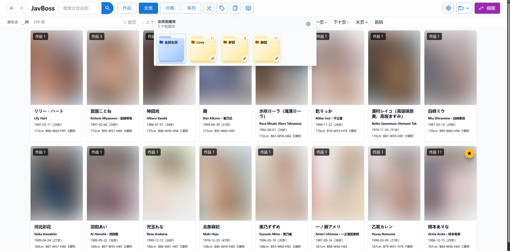
</p>

<p align="center">
  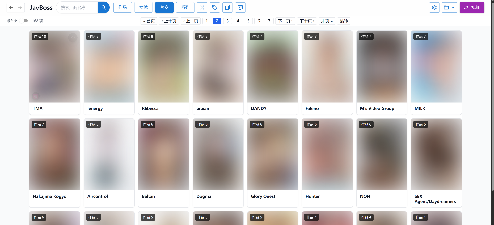
  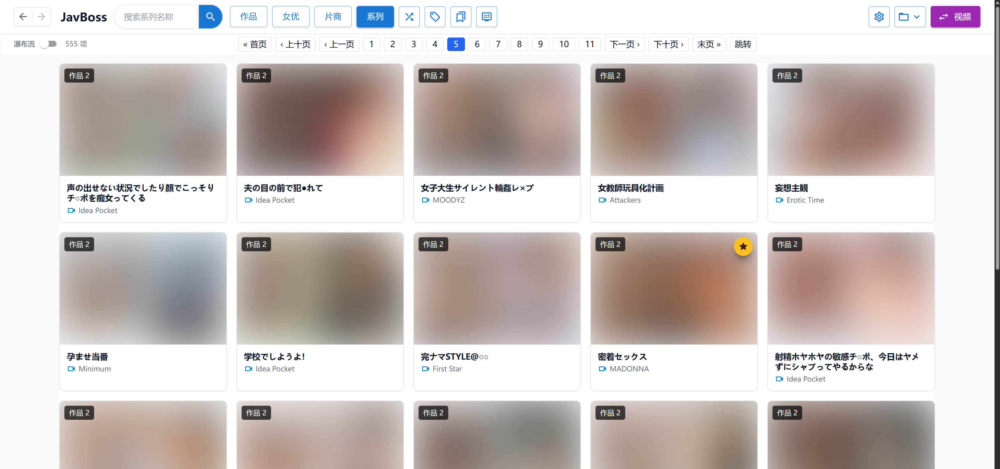
</p>

<p align="center">
  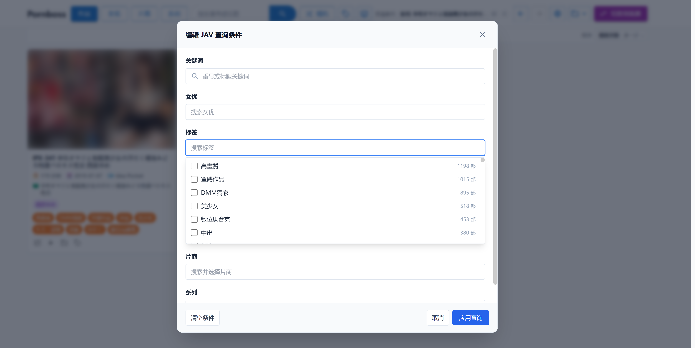
  
</p>

<p align="center">
  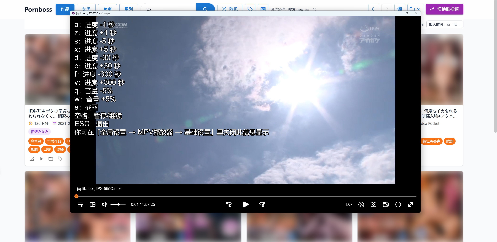
  
</p>

<p align="center">
  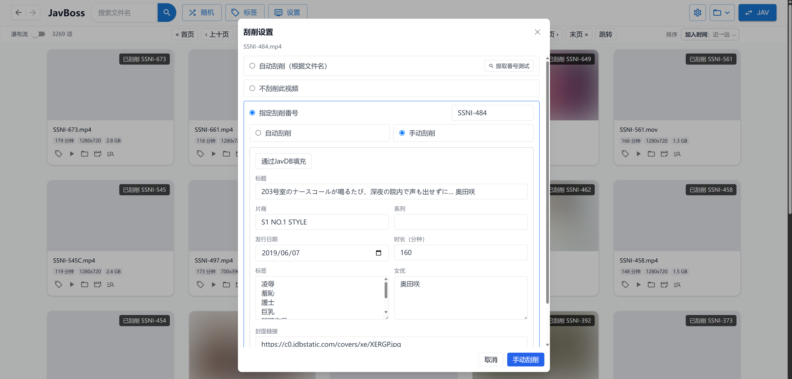
  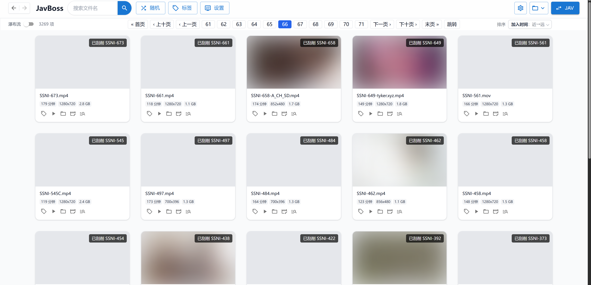
</p>

<p align="center">
  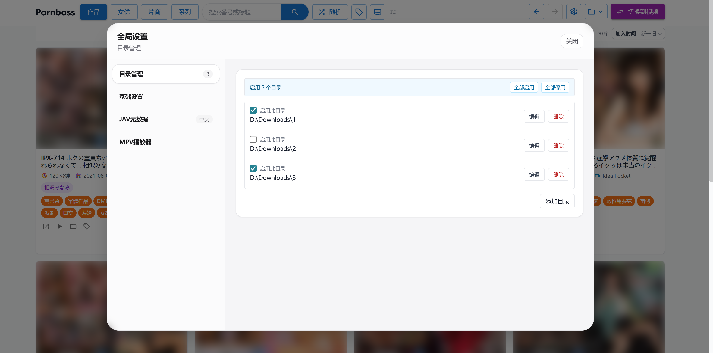
  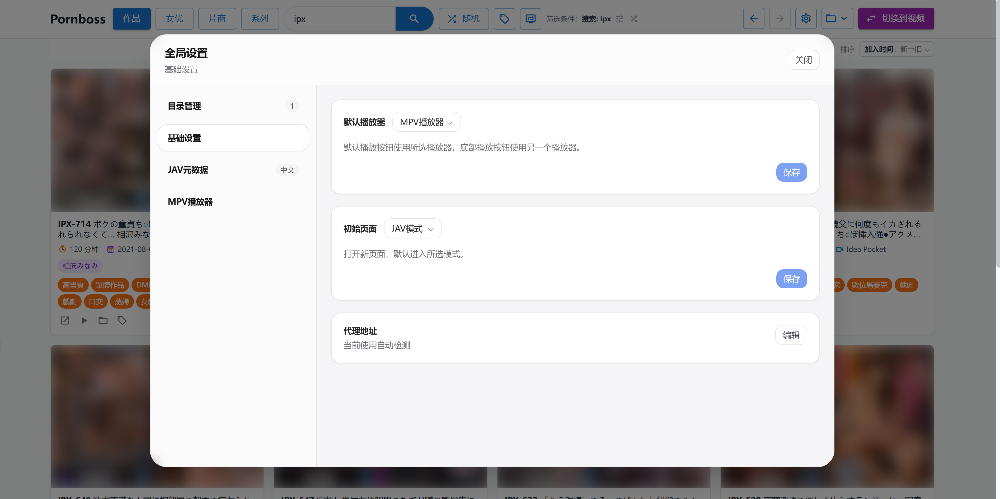
</p>

<p align="center">
  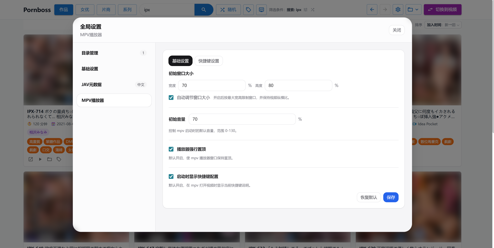
  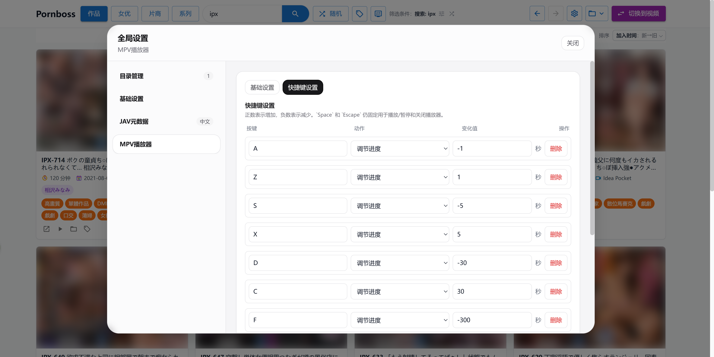
</p>


## ✨ 功能介绍

### 1. 🔎 强大的 JAV 刮削和检索

JavBoss 会从文件名中自动提取番号，例如 `IPX-633`、`SSIS-001`、`ipx633_ch` 等常见格式，并将识别出的影片归入 JAV 媒体库。

- 内部整合多个数据源（javbus、avmoo、theporndb、javdatabase等等），不同信息自动从最合适的数据源获取。
- 支持手动刮削视频到 JAV，解决冷门番号无法被自动刮削的问题。
- 自动抓取作品标题、发行时间、封面、演员、标签等基本信息。
- 自动抓取并补全女优信息，身高、中英文名、三围、出生日期等等。
- 自动抓取并补全 JAV 厂商和系列信息。
- 强大的排序功能：支持多种 JAV 和女优排序方式：发行日期、时长、播放次数、身高、年龄、三围等等。
- 强大的查找和筛选功能，支持编辑各种复杂查询（关键字、女优、标签、厂商、系列等）进行分页浏览。
- 强大的随机浏览功能：支持全局随机显示以及任意筛选条件下随机显示。
- 支持作品、厂商、系列、女优收藏夹，并且可以自由排列单个收藏夹内的items顺序，

### 2. 📁 智能目录管理与可迁移数据

添加本地视频目录后，JavBoss 会在后台持续同步目录内容，已经入库的视频可以立即浏览，扫描和资料补全会逐步完成。

- 支持多个资源目录，适合本机硬盘、NAS 挂载目录、移动硬盘等场景。
- 自动截图生成视频封面，生成视频指纹落库，通过视频文件名尝试关联 JAV 番号。
- 可任意选择启用目录，未启用的目录内容自动隐藏。
- 目录不可用时不会删除历史索引，移动硬盘重新接入后数据会恢复显示。
- 标签、JAV 关联和视频指纹绑定，常见的视频移动、改名场景不用重新打标签。
- 数据库、封面、缩略图等运行数据集中保存在 `data/`，升级或迁移时复制 `data/` 目录即可。

### 3. ⏯️ 内置 mpv 播放器

JavBoss 集成 [mpv](https://github.com/mpv-player/mpv) 播放能力，点击视频即可调用轻量、高性能的本地播放器，适合播放大文件、高码率和各种常见视频格式。

- 通过 mpv 播放原始本地文件，避免浏览器格式兼容性限制。
- 支持默认音量、窗口尺寸、置顶等播放配置。
- 支持自定义快捷键，例如快进、快退、音量调整等。
- 自带 [ModernZ](https://github.com/Samillion/ModernZ) OSC 脚本，mpv 播放时默认使用更现代的播放器控制界面。
- 使用 mpv 播放时可随时截图，截图文件保存在`/data`目录中。
- 在普通视频库和 JAV 作品库中都可以打开截图面板，按时间顺序预览所有 mpv 截图。
- 截图面板支持放大预览、删除截图，并可直接从某张截图对应的时刻继续播放。
- 可在全局设置中选择默认播放器，支持使用 mpv 或系统播放器播放视频，并可定位到文件所在目录。

### 4. 🧭 简单易用的 UI

前端界面围绕“快速找到想看的视频”设计，不堆复杂设置，把常用操作放在筛选、排序、标签和随机浏览上。

- 支持普通视频库、JAV 作品库、女优视角浏览。
- 自适应响应式布局，更小的浏览器缩放倍数下会每行会显示更多的内容。
- 所有可见信息将尽可能展示，不做复杂的页面嵌套。
- 所有的操作按钮都放在触手可及的位置，尽可能的降低用户心智负担。


## 注意事项

- JavBoss 是本地媒体库管理工具，不提供任何资源分发、获取、共享等功能。
- JAV 元数据、封面资料首次抓取依赖外部站点可访问性，请确保网络环境通畅。
- 发布包根目录会包含 `config.toml` 文件，程序默认启动端口为 8655，如有需要可修改其中 port 的值更换启动端口。


## Client 模式说明

**备注：此模式唯一的用处就是使用本机 MPV 播放器播放局域网 JavBoss 中的视频，没有此项需求的用户可忽略。**

Client 模式可连接远程 JavBoss Server，浏览远程媒体库并使用本机 MPV 播放视频，同时支持本地播放器设置及截图自动同步。

使用此模式需要在本地安装 JavBoss，然后在程序目录的 `config.toml` 中设置远程 JavBoss Server 地址，之后正常启动 JavBoss 即可：

```toml
server_url = "http://192.168.1.100:8655"
```

也可以通过命令行临时指定远程 Server：

- Windows：`.\javboss.exe --server-url http://192.168.1.100:8655`
- Linux / macOS：`./javboss --server-url http://192.168.1.100:8655`

## Q&A

- Q: 为什么要做本地web应用而不做桌面端应用？
- A: 这不是技术问题，纯粹是从用户体验角度出发。比如说以下场景都是浏览器的独有优势：
  1. 想同时查看 女优A、女优B的jav，并检索包含关键词C的视频，只要打开多个浏览器标签即可。
  2. 在当前页面想点击查看一个新页面内容，又不想丢失当前页，直接ctrl+鼠标左键或者右键点击选择在新页面中打开。
  3. 不小心点错了，想回到上一页的内容，直接点击浏览器回退按钮。
  4. 看到一个Jav或者女优，想检索一下相关信息，直接鼠标拖动选中文本，右键选择在Google中检索。


<br>

- Q: 使用时要一直确保外网访问通畅吗？
- A: JavBoss 所有的信息读取来源于`\data`目录，已经看到的信息都是永远离线可用的。无法访问外网意味着 JavBoss 无法做后续的 JAV 信息的抓取和更新，已入库的信息不受影响。

<br>

- Q: 新下载的视频怎么入库？想删除一些视频怎么办？
- A: 需要重新触发一次扫描，详情见上方的 `目录扫描和 JAV 刮削说明`。

<br>

- Q: 视频文件夹在移动硬盘里，没插硬盘时启动会丢数据吗？
- A: 不会。目录不可用时，JavBoss 会保留已入库数据；移动硬盘再次接入后，数据会恢复显示。

<br>

- Q: 某个移动硬盘不够大了，文件夹要移动到新的硬盘里怎么办？
- A: 直接移动文件夹，然后在“目录管理”里点击编辑更新目录路径，不用担心数据丢失，JavBoss 会处理好这一切。

<br>

- Q: 换电脑时怎么迁移？
- A: 在新电脑下载对应系统的 `javboss`，然后将旧电脑的`data/`目录复制到新电脑的 `javboss` 目录下即可。（如果视频目录路径也发生了变化，请在目录管理中点击编辑进行调整）

## 开发者文档

开发环境、常用命令及项目结构请参阅 [DEVELOPMENT.md](DEVELOPMENT.md)。

## 风险提示与免责声明

- 本项目是本人在学习 Go 语言期间开发的练手项目，仅供学习与交流。
- 使用本项目时，请遵守所在国家或地区的法律法规。
- 请勿将本项目用于任何商业用途。
- 用户应自行承担使用本项目产生的一切后果，开发者不对用户的任何使用行为承担法律责任。
